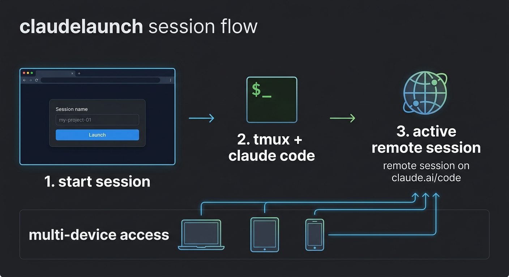

# claudelaunch

[](https://github.com/maragudk/claudelaunch/actions/workflows/ci.yml)

Claude Code launcher -- starts persistent Claude Code sessions inside tmux, accessible remotely via claude.ai.

Made with sparkles by [maragu](https://www.maragu.dev/).

> **Disclaimer:** This project is 100% vibe-coded. No humans were harmed in the making of this software, but no humans reviewed it either.



## How it works

1. claudelaunch runs an HTTP server on port 6677
2. Open the web UI, type a session name, and hit Launch
3. A tmux session is created running `claude --dangerously-skip-permissions --remote-control` in `~/Developer/<name>`
4. The server captures the remote session URL from claude's output
5. Click "Open Session" to open it in claude.ai/code from any device (including iPad)

## Install

```shell
go install maragu.dev/claudelaunch/cmd/claudelaunch@latest
```

## Usage

Run the server:

```shell
claudelaunch
```

Or in a tmux session so it persists:

```shell
tmux new-session -d -s claudelaunch-server claudelaunch
```

Then open http://localhost:6677 and launch a session.

You can also attach to sessions locally with `tmux attach -t <session-name>`.
